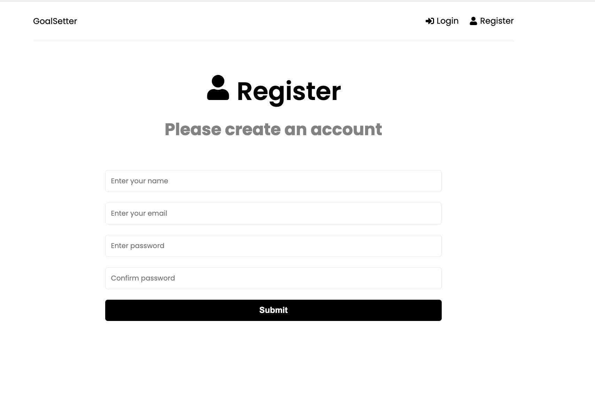
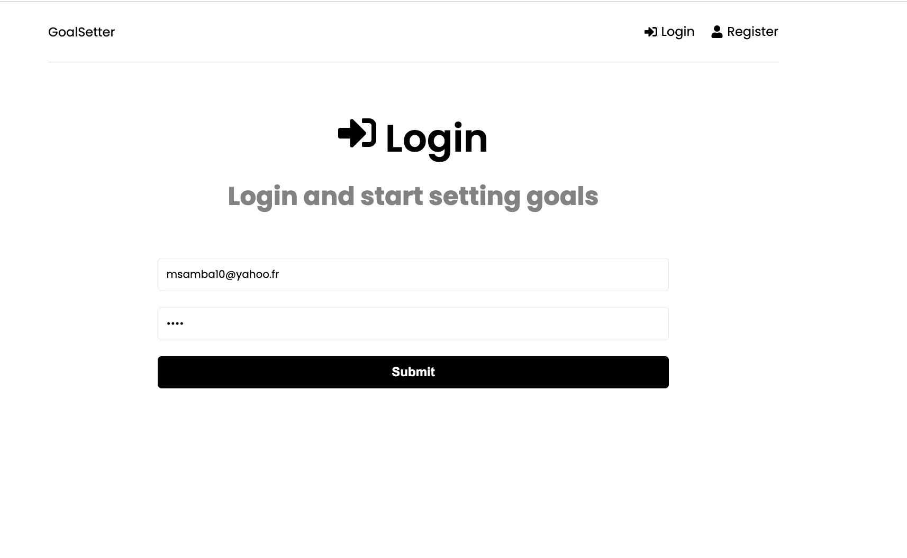
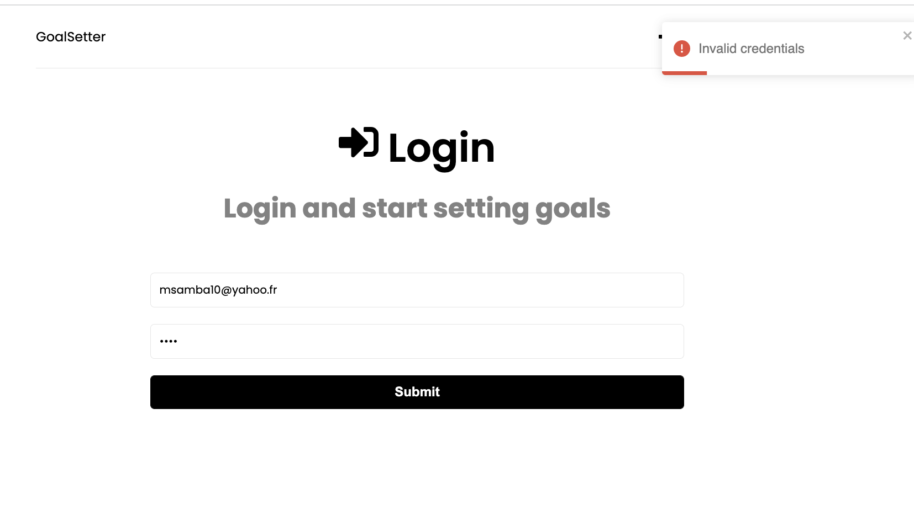
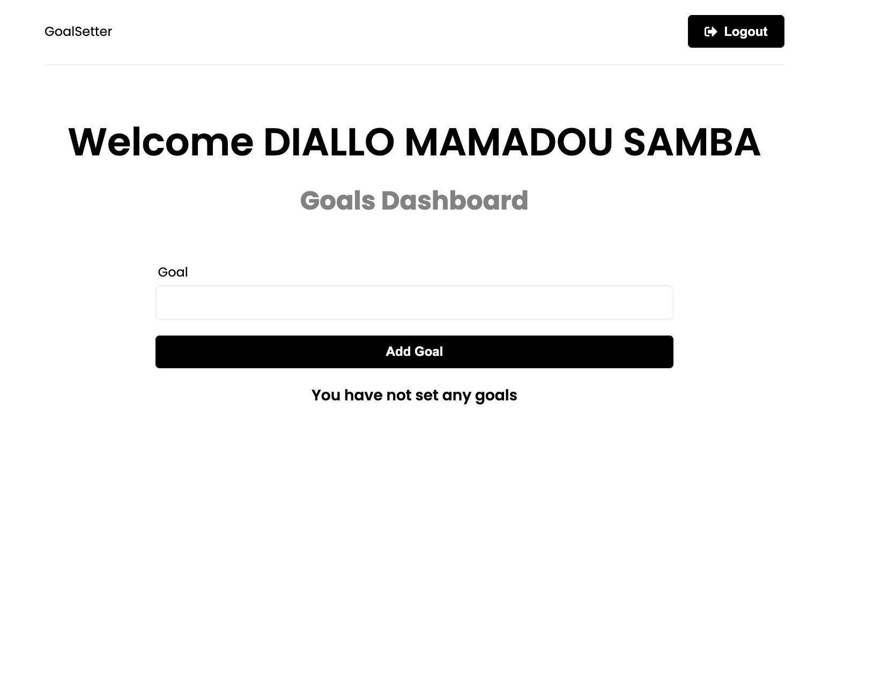
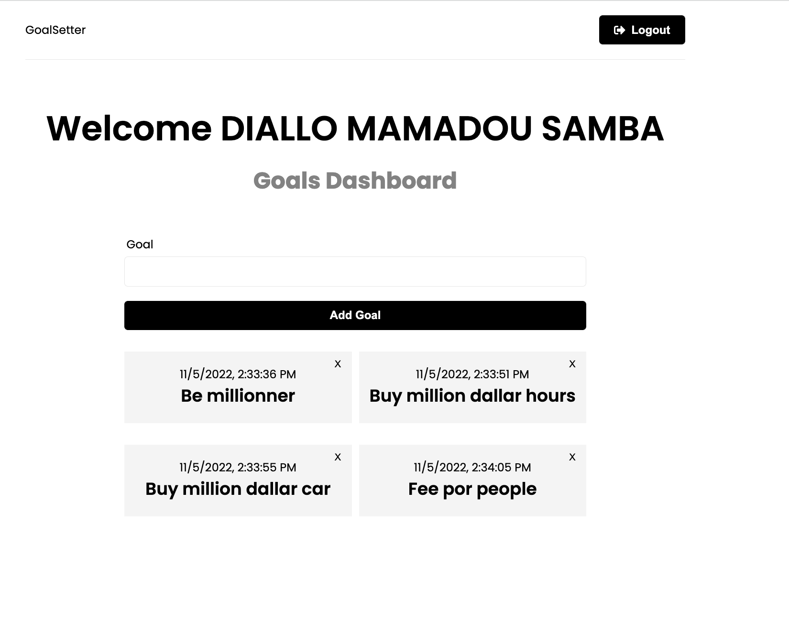
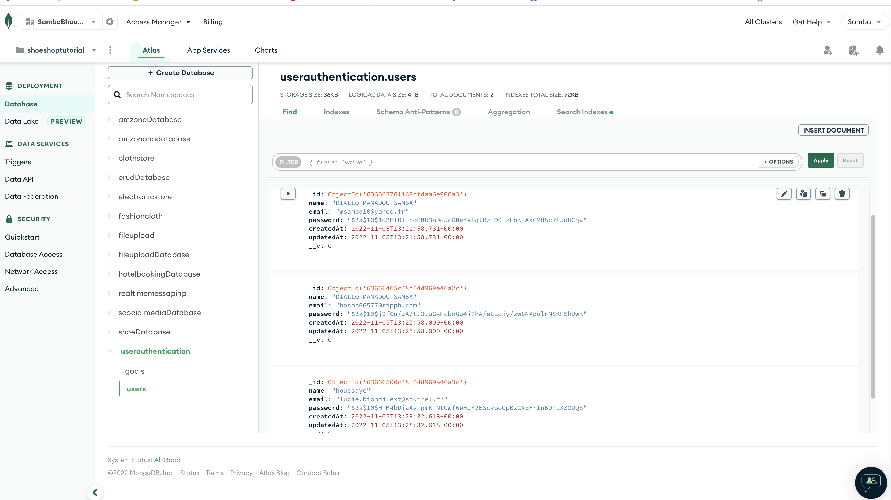
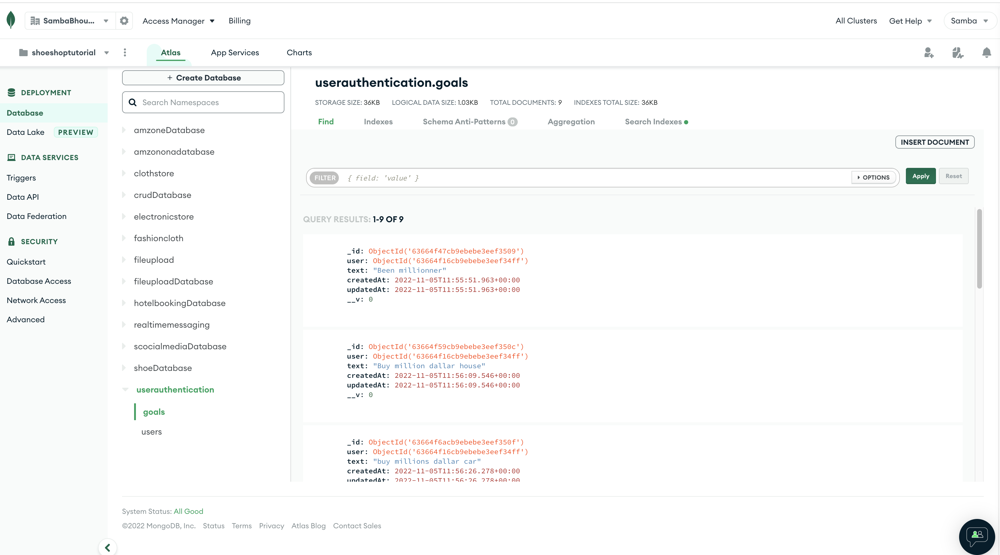

# MERN Stack - Frontend Authentication | Redux Toolkit
In this App, we will create our frontend and add authentication using Redux Toolkit to manage our global state

#  Timestamps
-Page Components
- React Router Setup
- Header & Navigation
- Register Page
- Login Page
- Concurrently Setup
- Redux Start & Auth Slice
- Start User Registration
- Extra Reducers For Register
- Hook Up Register Form
- Logout Function
- Start User Login
- Extra Reducers For Login
-Hook Up Login Form

# `screenShot`

